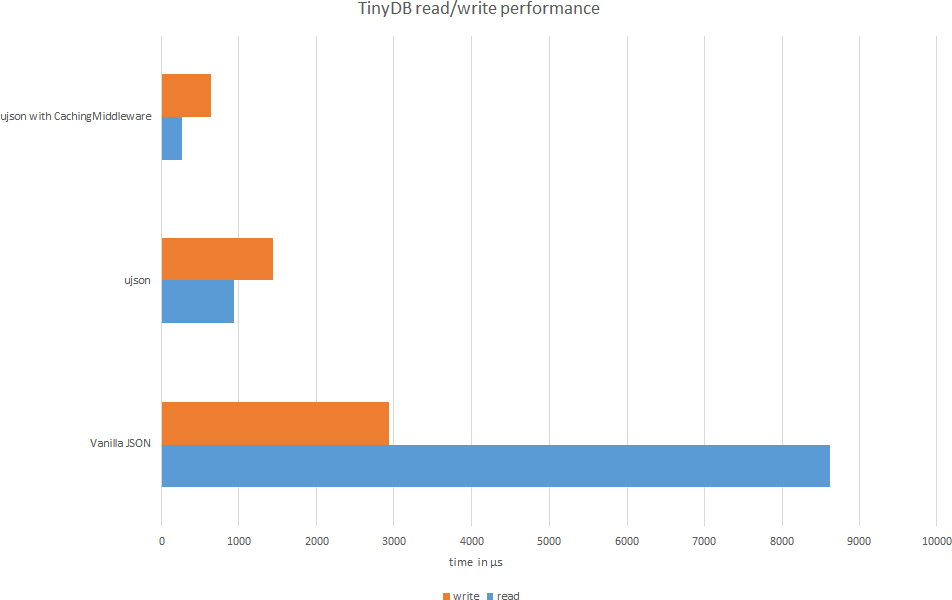

Limitations of TinyDB
=====================

JSON Serialization
^^^^^^^^^^^^^^^^^^

TinyDB serializes all data using the
`Python JSON <http://docs.python.org/2/library/json.html>`_ module by default.
It serializes most basic Python data types very well, but fails serializing
classes and stores ``tuple`` as ``list``. If you need a better
serializer, you can write your own storage, that e.g. uses the more powerfull
(but also slower) `pickle  <http://docs.python.org/library/pickle.html>`_ or
`PyYAML  <http://pyyaml.org/>`_.

Performance
^^^^^^^^^^^

TinyDB is NOT designed to be used in environments, where performance might be
an issue. Altough you can improve the TinyDB performance as described below,
you should consider using a DB that is optimized for speed like Buzhug_ or
CodernityDB_.

How to Improve TinyDB Performance
`````````````````````````````````````

The default storage serializes the data using JSON. To improve performance, you
can install `ujson <http://pypi.python.org/pypi/ujson>`_ , a extremely fast
JSON implementation. TinyDB will auto-detect and use it if possible.

In addition, you can wrap the storage with the
:class:`~tinydb.middlewares.CachingMiddleware` which reduces disk I/O.




.. References
.. _Buzhug: http://buzhug.sourceforge.net/
.. _CodernityDB: http://labs.codernity.com/codernitydb/